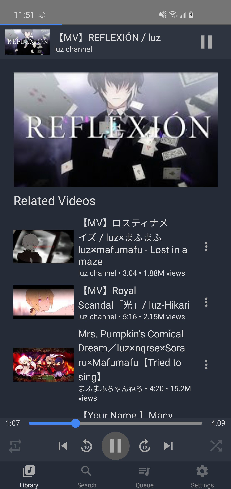
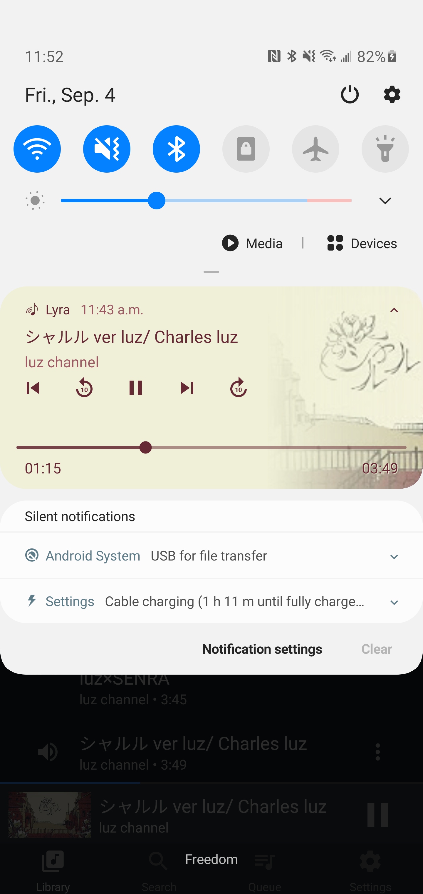

# Lyra Mobile

Lyra is a cross-platform music player app that can play songs on your computer, phone, and on YouTube.

This repository contains the code for the mobile app version of Lyra, written in React Native. Also check out the [desktop and browser app](https://github.com/LenKagamine/lyra).

<div align="center">




</div>

## Features

- Play songs stored on your phone
- Organize songs into playlists
- Search for songs on YouTube and play them with only audio
- Play songs in background

## Development

To run locally,

```sh
yarn run ports         # Port forward for debugging
yarn run start         # Start Metro
yarn run android / ios # Install app
```

For debugging, install [Flipper](https://fbflipper.com/) or the [React Native Debugger](https://github.com/jhen0409/react-native-debugger).

To build,

```sh
yarn run android:release  # Install release version
```
